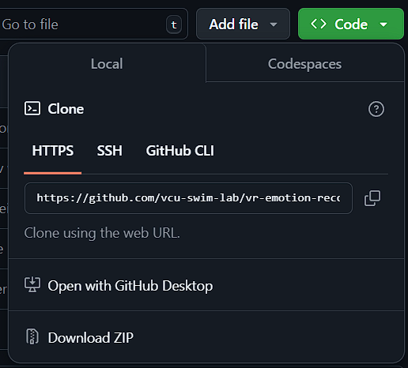
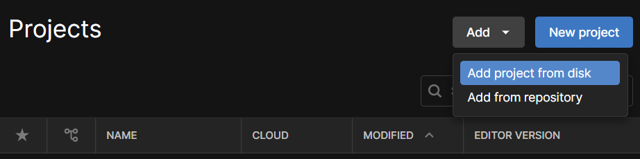

# Emotion Gathering Tool
## Setup the project

1. Get Unity 6 from the [Unity Hub](https://unity.com/unity-hub).

2. When picking the platforms for Unity, make sure to select "Android Build Support", along with the "Android SDK & NDK Tools and OpenJDK" sub-options selected, like shown below.

3. Open the project on [Github](https://github.com/vcu-swim-lab/vr-emotion-study.git), download it (click Code > Download Zip) and unzip at your location of choice.

4. Download the videos from [here](https://drive.google.com/drive/folders/1jk0xmhbNAqwscgyRv5j2f-RBSsarA79Q?usp=drive_link). Unzip the videos and place them in the [Assets/Videos](./Assets/Videos/) folder of the project.
5. Within the Projects menu in Unity Hub, click "Add" then "Add project from disk". Navigate to your local copy of the project and click "Add project".

## Setup the headset

1. Install the [Meta Quest Link](https://www.meta.com/quest/setup/) app and log in with your Meta account.
2. Open Meta Quest Link and on Settings > General, enable Unknown Sources. Then on the Beta tab, enable Public Test Channel. This is needed because the project needs some experimental features.
3. Connect your headset and open the settings app. On the beta features page, enable Eye tracking and Natural Facial Expression.

Now you are ready to run the project.

## Running the project

1. Open the project in Unity and press the play button to run it.
2. On the Game tab in Unity, click the "Next" button every time it shows up to play the next video. You will be able to see what the subject sees in the meantime, so you can know when to progress with the experiment.

The experiment consists of two parts: the first part shows seven videos shuffled randomly, each evoking a specific emotion.

For each video, please ask the subject to complete a section from the google form related to the video they saw.
You can find the form [here]([https://forms.gle/6CBRNqYE67rHgoXcA](https://docs.google.com/forms/d/e/1FAIpQLSc2rsAwVYuVXZTkve5oVQEMmNknyEPRVU_aoOqYee3J0f8ANw/viewform?usp=header).

On the second part the subject is asked to mimic the emotions shown to him by words. When each video starts, the project measures certain aspects of the facial expressions, along with a video of the subject's face (as an avatar).

## Getting the results

The extracted data is stored on the [VideoRecordings](./VideoRecordings/) folder on the root of the project. For each run, a separate folder is created, containing videos and data collected during the experiment. If you notice any issues with videos (eg. black screens), please let us know.
