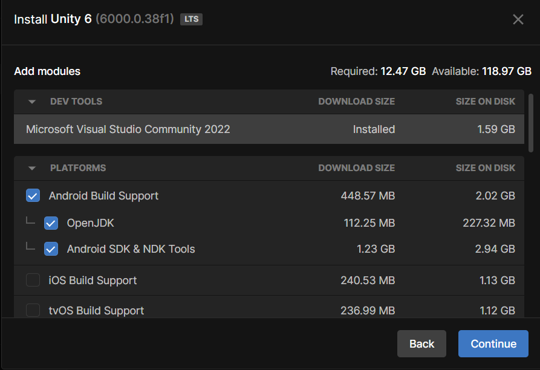

# Emotion Gathering Tool
## Setup the project

1. Get Unity 6 from the [Unity Hub](https://unity.com/unity-hub).

2. When picking the platforms for Unity, make sure to select "Android Build Support", along with the "Android SDK & NDK Tools and OpenJDK" sub-options selected, like shown below.

3. Open the [project](https://github.com/vcu-swim-lab/vr-emotion-recognition.git), download it (click Code > Download Zip) and unzip at your location of choice.

4. Download the videos from [here](https://drive.google.com/drive/folders/1jk0xmhbNAqwscgyRv5j2f-RBSsarA79Q?usp=drive_link). Unzip the videos and place them in the [Assets/Videos](./Assets/Videos/) folder of the project.
5. Within the Projects menu in Unity Hub, click "Add" then "Add project from disk". Navigate to your local copy of the project and click "Add project".

## Setup the headset

1. Install the [Meta Quest Link](https://www.meta.com/quest/setup/) app and log in with your Meta account.
2. Open Meta Quest Link and on Settings > General, enable Unknown Sources. Then on the Beta tab, enable Public Test Channel. This is needed because the project needs some experimental features.
3. Connect your headset and open the settings app. On the beta features page, enable Eye tracking and Natural Facial Expression.

Now you are ready to run the project.

## Running the project

1. Open the project in Unity and press the play button to run it.
2. On the Game tab in Unity, there is a button shown. As a supervisor of the experiment, you need to press this button every time you want the subject to see another video. You will be able to see what the subject sees in the meantime, so you can know when to progress with the experiment.

The experiment consists of two parts: the first part shows seven videos shuffled randomly and the subject is asked about the emotions experienced during each video and on the second part the subject is asked to mimic the emotions shown to him by words. When each video starts, the project measures certain aspects of the facial expressions of the subject every 100 ms, along with a video of the subject's face (as an avatar).

## Getting the results

The extracted data is stored on the [VideoRecordings](./VideoRecordings/) folder on the root of the project. For each run, a separate folder is created, whose name is of the form `{year}{month}{day}-{hour}{minute}` (eg. 20250215-1020 means the experiment was run on 10:20 AM, 15 February 2025).Inside the session folder, you will find videos of the facial expression recordings, along with the weights collected during the recording process. Videos named `video_${emotion}.mp4` are recordings from the first part of the run, where videos that "trigger" an emotion are shown to the subject. Meanwhile videos named `ACT_${emotion}.mp4` are recordings from the second part of the run, where the subject is asked to mimic the emotion shown in words. The same logic applies to weight files; `weight_${emotion}.csv` are the weights collected from the first part, and `ACT_${emotion}.csv` are the weights collected from the second part. The weight samples are collected 10 times per second, to allow for a more complete picture of transitions in facial expressions. 